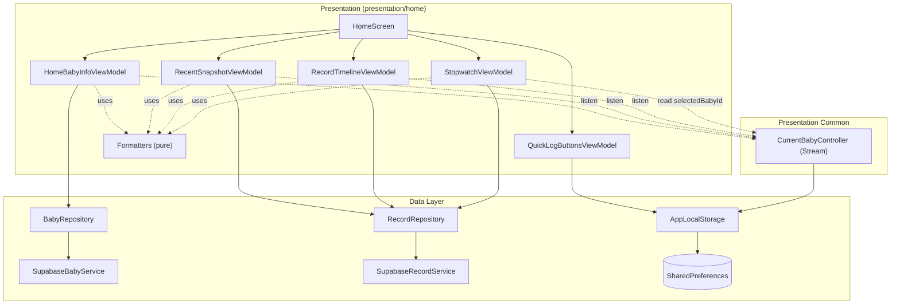

# 🛠️ Home Screen — Presentation Layer 구현 계획

## 0. 스펙 요약 (한눈에)

- `HomeScreen` 한 화면을 5개 영역 `[A]`~`[E]`로 구성하고, 영역별로 **독립된 sub-ViewModel**을 둔다 (스펙 §2, §11).
  - `[A]` Baby Info Header, `[B]` Quick-log 버튼 Row, `[C]` Recent Snapshot Row(3슬롯), `[D]` Stopwatch Card(조건부), `[E]` Record List(무한 스크롤).
- 한 영역의 실패가 다른 영역을 가리지 않는 **부분 실패** 정책 (스펙 §4.3).
- 일부 케이스는 화면 전체를 다른 라우트로 보내는 **전역 분기** (`welcome` / `login`, 스펙 §4.2).
- 데이터 레이어 계약(`BabyRepository`, `RecordRepository`, `CurrentBabyController`, `AppLocalStorage`)은 이미 존재하며 **소비만** 한다. 본 PR의 데이터 레이어 변경은 `AppLocalStorage` 키 1종 추가 + `CurrentBabyController`의 Stream 전환(§3.3·§7.4)뿐.
- 표시용 문자열/색/라벨 가공은 전부 Presentation 책임 (스펙 §3). 순수 formatter로 분리.
- 스탑워치는 **순수 메모리 상태**, 영속 안 함 (스펙 §5.3, §8.1).

---

## 1. ViewModel 설계 — UI State / 이벤트 / 노출 프로퍼티

**상태는 영역이 실제로 필요로 하는 만큼만** 둔다. 단일 비동기 동작만 있는 영역은 기존 `enum ActionState { idle, loading, success, error }` + payload 필드로 충분하고, 별도 sealed UiState 클래스를 만들지 않는다.

각 VM은 `presentation/home/view_models/`에 둔다.

### 1.1 `HomeBabyInfoViewModel` — `[A]`

단일 조회(`getBaby`)만 하는 영역

- **보유 상태**: `ActionState _status`, `Baby? _baby`, `AppException? _error`
- **이벤트**: `load(String babyId)`, `retry()`
- **노출**: `status`, `baby`, `error`, 파생 `String? name`, `String? dateLabel`(§3.2, formatter 위임)
- **전역 분기**: VM은 라우팅하지 않는다. `error?.code == notFound | unauthorized`를 화면이 읽어 §4.2 처리.

### 1.2 `RecentSnapshotViewModel` — `[C]`

3개의 독립 슬롯. 슬롯마다 (status + 최근 1건) 만 있으면 되므로, 가벼운 holder로 표현한다.

- **슬롯 holder**: `({ActionState status, CareRecord? record})` (Dart record) 또는 동등한 단순 클래스. `empty`는 별도 상태가 아니라 `status==success && record==null`로 표현.
- **보유 상태**: `_feed`, `_diaper`, `_wake` 3개 holder + 슬롯별 `AppException? error`
- **이벤트**: `loadAll(babyId)`, `retryFeed()`/`retryDiaper()`/`retryWake()`, `notifyAfterRecordChanged(CareRecord)`, `notifyAfterRecordDeleted(CareRecord)`
- **호출**: `getRecentFeedings/Diapers/Wakes(babyId, limit: 1)` (스펙 §7.1)
- **타입→슬롯 매핑**(생성/삭제 후 재호출 결정, 스펙 §5.5·§5.9):
  - `feed` ⊃ `breast, formula, pumpingFeed, pumping, babyFood` · `diaper` ⊃ `diaper` · `wake`(sleep) ⊃ `sleep`
  - `water, snack` → 어느 슬롯에도 영향 없음

### 1.3 `RecordTimelineViewModel` — `[E]`

첫 페이지와 다음 페이지가 동시에 다른 상태일 수 있어 **두 개의 `ActionState`** 가 필요. 그 외엔 평범한 리스트 + 커서.

- **보유 상태**: `ActionState _firstPageStatus`, `ActionState _nextPageStatus`, `List<CareRecord> _items`, `String? _nextCursor`, `bool _hasMore`, `AppException? _firstPageError`, `AppException? _nextPageError`
- **이벤트**: `loadFirstPage(babyId)`, `loadNextPage(babyId)`, `refresh(babyId)`, `prepend(CareRecord)`, `remove(String recordId)`, `removeAndDelete(String recordId)`
- **노출**: `firstPageStatus`, `nextPageStatus`, `List<CareRecord> items`(unmodifiable), `hasMore`, 에러들. 빈 상태 = `firstPageStatus==success && items.isEmpty`.
- **가드**: `loadNextPage`는 `_hasMore && _nextPageStatus != loading`일 때만. 빈 페이지 방어 + id dedupe(스펙 §8.4).
- **prefetch**: 트리거 판정은 위젯 `ScrollController`, VM은 `loadNextPage`만 받음 (스펙 §11.3).

### 1.4 `StopwatchViewModel` — `[D]`

데이터 종류(없음/모유/수면)에 따라 **보유 필드 자체가 달라지므로**, 여기서만 sealed 모델(`StopwatchMode`)을 둔다. 저장 진행은 단순하므로 enum으로.

- **모드 모델** (`sealed StopwatchMode`): `Inactive` / `BreastMode` / `SleepMode` — `presentation/home/models/stopwatch_mode.dart`
- **phase**: `enum StopwatchPhase { idle, running, paused }`
- **저장 상태**: `enum SaveStatus { idle, saving, failed }` + `AppException? _saveError`
- **보유 상태**:
  - breast: `_leftSeconds`, `_rightSeconds`, `_leftPhase`, `_rightPhase`, `_leftFirstStartedAt`, `_rightFirstStartedAt`
  - sleep: `_sleepSeconds`, `_sleepPhase`, `_sleepFirstStartedAt`
  - 각 phase의 `running` 진입 wall-clock 기준점 (누적은 wall-clock 차이로 재계산 — 스펙 §8.1 백그라운드 복귀)
- **이벤트**: `enterBreast()`, `enterSleep()`, `toggleLeft()`, `toggleRight()`, `toggleSleep()`, `completeBreast()`, `completeSleep()`, `retryAfterFailure()`, `discardAfterFailure()`, §5.3.5/§5.3.6 dialog 결과용 `forceEnter(mode)` / `completeForNavigate()` / `discardForNavigate()`
- **노출**: `mode`, 좌/우 phase·표시문자열, `bool completeEnabled`, `saveStatus`, `bool hasElapsed`(누적 ≥1초 — dialog 분기 §5.3.5/§5.3.6)
- **불변식 강제(스펙 §5.3.1)**: 한쪽 `running` 전환 시 다른쪽이 `running`이면 자동 `paused`. **양쪽 동시 running 불가**를 메서드 내부에서 보장.
- **저장 변환(스펙 §6.3·§6.4)**: `round(seconds/60)`, `null` vs `0` 분기, `startedAt`=firstStartedAt min(UTC), `endedAt`=`DateTime.now().toUtc()`, `sleepType`=`inferSleepType`.
- **createRecord 대상 babyId**: 구독이 아니라 `currentBabyController.selectedBabyId`를 Complete 시점에 동기로 읽는다 (스펙 §6.7 "유지하고 이동" 후 변경된 baby로 잡히는 동작과 일치).
- **Ticker**: VM이 `Stream.periodic(1s)` 구독을 보유, 표시값은 매 tick wall-clock 재계산 (StatelessWidget 규칙 유지, D-3).

### 1.5 `QuickLogButtonsViewModel` — `[B]`

**서버 통신이 없고 로컬 KV만 본다.** loading/success/failure 상태가 필요 없다 → 상태 머신 없이 리스트만 보유.

- **보유 상태**: `List<QuickLogButton> _buttons` (`QuickLogButton{ RecordType type; bool enabled }`, 순서=리스트 순서) — `presentation/home/models/quick_log_button.dart`
- **이벤트**: `init()`(로컬에서 동기 로드, 없으면 default §6.1), `reorder(from, to)`, `toggle(RecordType)`
- **노출**: `List<QuickLogButton> buttons`, `List<QuickLogButton> enabledButtons`
- **규칙**: 마지막 1개 off 비활성(스펙 §5.7), 미지 enum 무시 + 누락 enum default-on 끝에 추가(스펙 §6.2). 변경 즉시 직렬화 영속.
- **직렬화 책임은 VM** (스펙 §6.2). JSON `[{"type":"formula","enabled":true}, …]`.

---

## 2. 의존성 매핑

### 2.1 ViewModel ↔ Repository ↔ DataSource 표

| ViewModel | 사용 Repository / 협력자 | Repository 메서드 | DataSource(Service) |
|---|---|---|---|
| `HomeBabyInfoViewModel` | `BabyRepository`, `CurrentBabyController` | `getBaby(id)` | `SupabaseBabyService` |
| `RecentSnapshotViewModel` | `RecordRepository`, `CurrentBabyController` | `getRecentFeedings/Diapers/Wakes(id, limit:1)` | `SupabaseRecordService` |
| `RecordTimelineViewModel` | `RecordRepository`, `CurrentBabyController` | `getRecords`, `createRecord`*, `deleteRecord` | `SupabaseRecordService` |
| `StopwatchViewModel` | `RecordRepository`, `CurrentBabyController` | `createRecord(babyId, BreastDetail/SleepDetail)` | `SupabaseRecordService` |
| `QuickLogButtonsViewModel` | `AppLocalStorage` | (KV) `quickLogButtonsJson` get/set/remove | `SharedPreferences` |
| 입력 dialog 플로우 | `RecordRepository`, `CurrentBabyController` | `createRecord(babyId, *Detail)` | `SupabaseRecordService` |
| baby 전환 sheet | `BabyRepository`, `CurrentBabyController` | `getMyBabies()`, `select(id)` | `SupabaseBabyService` |

\* `createRecord` 후 `[E]` prepend는 `RecordTimelineViewModel`이, `[C]` 슬롯 재호출은 `RecentSnapshotViewModel`이 담당. 두 VM의 협업은 화면이 중재 (§3.2).

### 2.2 Mermaid 다이어그램



- 화살표는 **단방향 의존**(상위→하위). UI는 Service를 직접 호출하지 않고 전부 Repository 경유.
- `[A]`/`[C]`/`[E]`는 `CurrentBabyController`의 **stream을 구독**하여 baby 변경 시 자기 영역 재호출. `[D]`는 구독 없이 Complete 시점에 `selectedBabyId`를 읽는다.

---

## 3. 클래스 연계 구조

### 3.1 영역 간 협업(무효화) 중재

생성/삭제 성공 시 `[E]`(prepend/remove)와 `[C]`(슬롯 재호출)가 함께 갱신돼야 한다(스펙 §6.6). VM 간 직접 참조를 피하기 위해 **화면 레벨에서 두 VM을 함께 호출하는 콜백**으로 중재한다.

- 입력 dialog / 스탑워치 Complete / swipe 삭제의 성공 콜백에서, 화면이 `context.read<RecordTimelineViewModel>()`와 `context.read<RecentSnapshotViewModel>()`를 함께 호출.
- `createRecord`/`deleteRecord` **호출 주체를 단일화**(타임라인 VM 소유)하여 중복 prepend/슬롯 재호출 책임을 명확히 한다.

### 3.2 화면 구성

```
HomeScreen (StatelessWidget)
 └ MultiProvider (화면 scope)
     ├ ChangeNotifierProvider<HomeBabyInfoViewModel>
     ├ ChangeNotifierProvider<RecentSnapshotViewModel>
     ├ ChangeNotifierProvider<RecordTimelineViewModel>
     ├ ChangeNotifierProvider<StopwatchViewModel>
     └ ChangeNotifierProvider<QuickLogButtonsViewModel>
   └ _HomeView (Scaffold + bottom nav + body, StatelessWidget)
```

- sub-VM은 전역의 `BabyRepository`/`RecordRepository`/`CurrentBabyController`/`AppLocalStorage`를 `context.read`로 주입받아 생성(스펙 §13.2).
- 첫 호출: `RecordDetailScreen`의 `..refresh()` 패턴처럼 `create`에서 `..init()`/`..load()` 트리거. 단, 첫 진입 부트스트랩(스펙 §7.1: `getMyBabies` → candidate 결정 → `getBaby`)은 화면 레벨에서 오케스트레이션하고, 그 결과 babyId로 각 영역 VM의 초기 로드를 시작한다.
- baby 변경 후속 처리는 `CurrentBabyController` stream 구독으로 자동(§3.3).

### 3.3 `CurrentBabyController` 구독 — Stream 방식

`CurrentBabyController`를 **`StreamController`로** 만들고, ViewModel이 그 stream을 listen한다.

- 컨트롤러: 내부에 `StreamController<String?>.broadcast()` 보유. `select`/`clear` 시 메모리 값 갱신 후 stream에 새 값 `add`. 동기 getter `String? selectedBabyId`는 유지. `dispose()`에서 controller close.
- 구독: `[A]`/`[C]`/`[E]` VM이 생성자에서 `babyIdStream.listen(...)` → 새 babyId 도착 시 자기 영역 `loading`으로 리셋 후 재호출. 각 VM은 `StreamSubscription`을 보유하고 `dispose()`에서 cancel.
- `null` emit(로그아웃/clear) → 화면이 §4.2 전역 분기(`login`)로 처리.
- baby 전환 race(스펙 §8.7): 응답 도착 시 응답의 babyId와 현재 `selectedBabyId`를 비교해 stale 응답 폐기.

---

## 4. 로딩 / 에러 / 빈 상태 처리 전략

| 영역 | loading | empty | error(영역 한정) | 전역 분기 |
|---|---|---|---|---|
| `[A]` | 라벨/이름 스켈레톤 2줄 | — | 라벨 자리 "다시 시도" + 스낵바 1회 | `notFound`→`welcome`, `unauthorized`→`login`+`clear()` |
| `[C]` 슬롯×3 | 스켈레톤 텍스트 | "기록 없음" (`status==success && record==null`) | "다시 시도" 아이콘(슬롯만 재호출) | `unauthorized`→전역 |
| `[E]` 첫 페이지 | 스켈레톤 row 5 | 중앙 안내 2줄(§9 카피) | 스낵바 1회 + 중앙 "다시 시도" | `unauthorized`→전역 |
| `[E]` 다음 페이지 | 하단 footer 로더 | — | 하단 inline "불러오기에 실패했어요 [다시 시도]" | `unauthorized`→전역(누적 리스트 정리) |
| `[D]` | (데이터 로딩 없음) | `inactive`=카드 없음 | `failed`=카드 잠금+[다시 시도][버리기] | `unauthorized`(저장 중)→전역 |
| `[B]` | (로딩 없음, 즉시 렌더) | — | — | — |

**공통 규칙**:
- 스낵바/전역 라우팅 같은 1회성 side effect는 위젯에서 `addPostFrameCallback` + 상태 소거로 처리 — `RecordDetailScreen` 기존 패턴.
- 전역 분기는 화면이 각 VM의 `error?.code`를 watch하다가 `unauthorized`/`notFound`를 만나면 `context.go(...)`(pushReplacement 의미). VM은 라우팅하지 않음.
- 부분 실패: 각 영역 위젯이 자기 VM 상태만 보고 렌더, 한 영역 error가 다른 영역 빌드를 막지 않음(스펙 §4.3).

---

## 5. 테스트 계획

mockito `@GenerateMocks` → `*.mocks.dart`, `test/`가 `lib/` 트리를 미러링.

### 5.1 Formatter 단위 테스트 — `test/presentation/home/formatters/*_test.dart`
- `date_label`: birthDate만 / dueDate만 / 둘 다 / 둘 다 null / D-Day·D+1·D-1 경계
- `relative_time`: 60초·60분·24시간 경계, 분=0
- `timer_duration`: 0→`00:00`, 59→`00:59`, 60→`01:00`, 3599→`59:59`, 3600→`01:00:00`, 5023→`01:23:43`
- `record_chip`: 9종 × 주요 분기(breast LEFT/RIGHT/BOTH/no-chip, babyFood/snack name 빈값, pumping 둘 다 null)
- `header_date`: 같은 날 헤더 1회 / 다른 날 분기
- `sleep_type_inferrer`: 21:59 / 22:00 / 05:59 / 06:00 경계

### 5.2 ViewModel 단위 테스트 — `test/presentation/home/view_models/*_test.dart`
- `HomeBabyInfoViewModel`: load 성공 / `notFound` / `unauthorized` / 그 외 / retry
- `RecentSnapshotViewModel`: 슬롯별 success·empty·error·retry 독립, 타입→슬롯 매핑 정확성
- `RecordTimelineViewModel`: 첫/다음 페이지, 빈 페이지 방어, `hasMore=false` 후 미호출, prepend/remove dedupe, refresh, 동시 호출 차단
- `StopwatchViewModel`: §4.1 전이 전부, 분 변환(29→0, 30→1, 90→2), `null` vs `0`, **한쪽 running 중 다른쪽 toggle→기존쪽 paused**, **양쪽 동시 running 불가 검증**, `sleep.idle→Start→running`, **누적 0초 시 다른 모드 진입은 저장 없이 dismiss**, sleepType 자동, 저장 실패→retry/discard
- `QuickLogButtonsViewModel`: default / 저장 JSON 로드 / reorder 영속 / toggle / 마지막 1개 비활성 / 미지 enum 무시 / 누락 enum 추가

### 5.3 위젯 테스트 — `test/presentation/home/...`
- 영역별 상태 렌더(loading/표시/empty/error)
- 입력 dialog: 시각 변경 / 미래 거부 / 빈 필드 분기
- swipe-to-delete dialog 노출
- 무한 스크롤 prefetch(가짜 `ScrollController`)

---

## 6. 레이어별 신규·수정 컴포넌트

### 6.1 Presentation (신규) — `lib/presentation/home/`
- `home_screen.dart` (**수정**: placeholder → 실제 화면)
- `view_models/`: 5개 VM (§1)
- `models/`: `quick_log_button.dart`, `stopwatch_mode.dart`
- `formatters/`: `date_label_formatter`, `relative_time_formatter`, `timer_duration_formatter`, `record_chip_formatter`, `header_date_formatter`, `sleep_type_inferrer`
- `widgets/`: `baby_info_header`, `quick_log_button_row`, `recent_snapshot_row`, `stopwatch_card`(+`stopwatch/breast_timer_view`, `sleep_timer_view`), `record_timeline_list`, `record_timeline_item`, `record_timeline_date_header`, `record_timeline_empty`, `record_timeline_error`, `skeletons/`
- `modals/`: `baby_switch_sheet`, `delete_confirmation_dialog`, `stopwatch_conflict_dialog`, `stopwatch_navigation_dialog`, `input/`(7종)
- `screens/quick_log_settings_screen.dart`

### 6.2 Domain
- **신규/변경 없음.** 기존 `Baby`, `BabyListItem`, `CareRecord`, `RecordDetailData`(전 변종), `Page`, enum 그대로 소비.

### 6.3 Data (수정)
- `lib/data/local/app_local_storage.dart` — `quick_log_buttons` 키 3메서드 추가
- Repository/Service 변경 없음 (필요한 메서드 모두 존재 확인).

### 6.4 공유 상태 / Routing / DI (수정)
- `lib/presentation/common/current_baby_controller.dart` — `ChangeNotifier` → `StreamController` 기반(§3.3)
- `lib/core/config/dependencies.dart` — `CurrentBabyController` 등록을 `ChangeNotifierProvider` → `Provider`(+`dispose`)로 변경
- `test/presentation/common/current_baby_controller_test.dart` — "listener notified" 검증 → "stream emit" 검증으로 수정
- `lib/routing/router.dart` — 버튼 수정 화면 sub-route 추가 (`home` 라우트 body는 이미 `HomeScreen` 사용 중)
