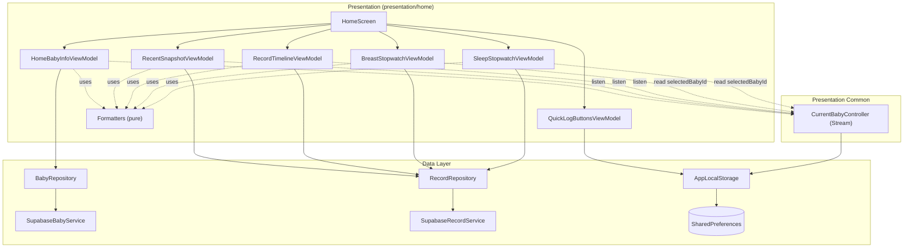

# 🛠️ Home Screen — Presentation Layer 구현 계획

## 0. 화면 구성과 영역 ↔ ViewModel 대응 (먼저 읽기)

홈은 한 화면 안에 **세로로 쌓인 5개의 독립 영역**으로 구성되고, 영역마다 전용 ViewModel이 하나씩 붙는다. 각 영역은 자기 데이터만 책임지며, 한 영역이 실패해도 다른 영역은 정상 렌더된다(**부분 실패**, spec §4.3).

| 영역 (spec §2 식별자) | 화면에서의 역할 | 담당 ViewModel | 주 데이터 출처 |
|---|---|---|---|
| 헤더 `[A]` | 현재 선택된 아기 이름 + D+N / D-day 라벨 | `HomeBabyInfoViewModel` | `BabyRepository.getBaby` |
| 빠른 기록 버튼 줄 `[B]` | 자주 쓰는 기록 버튼들. 순서/노출을 사용자가 커스터마이즈 | `QuickLogButtonsViewModel` | `AppLocalStorage` (로컬 KV) |
| 최근 요약 `[C]` | "마지막 수유 / 기저귀 / 기상 N시간 전" 3슬롯 | `RecentSnapshotViewModel` | `RecordRepository.getRecent*` |
| 스탑워치 카드 `[D]` (조건부) | 모유수유 타이머 / 수면 타이머 | `BreastStopwatchViewModel`, `SleepStopwatchViewModel` | `RecordRepository.createRecord` |
| 기록 리스트 `[E]` | 날짜별 무한 스크롤 타임라인 | `RecordTimelineViewModel` | `RecordRepository.getRecords` |

**공통 설계 원칙**
- 모든 ViewModel은 `ChangeNotifier`. View(위젯)는 `StatelessWidget` + `context.watch`/`Consumer`로 구독(프로젝트 규칙: StatefulWidget 미사용).
- ViewModel은 **Repository와 `CurrentBabyController`만** 의존한다. Service / `SharedPreferences`를 직접 만지지 않는다(spec §13.2).
- 표시용 문자열·색·라벨은 ViewModel이 아니라 **순수 formatter**가 만든다(spec §3, §11.6) — 테스트 용이.
- "현재 선택된 아기"는 `CurrentBabyController`가 단일 출처. ViewModel이 babyId를 인자로 들고 다니지 않는다(§1.0).

---

## 1. ViewModel 설계

각 VM은 `presentation/home/view_models/`에 둔다. 아래는 VM별로 **보유 상태 / 상태별 가능한 이벤트 / 노출값**을 정의한다. "상태별 가능한 이벤트" 표는 *어떤 상태에서 어떤 메서드를 부를 수 있는지*를 명시해, 잘못된 상태에서의 호출(예: 로딩 중 재호출)을 코드/리뷰 단계에서 걸러내기 위한 것이다.

### 1.0 공통 — "현재 아기"는 인자가 아니라 구독으로

**데이터 로딩 이벤트는 babyId를 인자로 받지 않는다.** "현재 선택된 아기"는 `CurrentBabyController` 한 곳이 단일 출처이고 `[A]`/`[C]`/`[E]` VM이 이미 그 변경을 구독하므로(§3.3), 호출마다 babyId를 다시 넘기면 중복이고 stale한 값을 넘길 위험만 생긴다.

각 VM은 생성자에서 `CurrentBabyController`를 주입받아:
- 초기값은 `currentBabyController.selectedBabyId`(동기 getter)로 읽고,
- 이후 변경은 stream 구독으로 받아 내부 `_babyId`에 보관한다(§3.3),
- 로딩 메서드(`load()` / `loadFirstPage()` / `loadNextPage()` / `refresh()` / `loadAll()`)는 인자 없이 이 `_babyId`를 사용한다. `_babyId == null`이면 아무 것도 하지 않는다,
- 응답 도착 시 응답이 기준한 babyId와 현재 `_babyId`를 비교해 **stale 응답은 폐기**(전환 race, spec §8.7).

이 규칙은 `[A]`/`[C]`/`[E]` 전부에 적용된다. 스탑워치(`[D]`)는 구독하지 않고 Complete 시점에 `selectedBabyId`를 동기로 읽는다(§1.4, spec §6.7).

### 1.1 HomeBabyInfoViewModel — 헤더 `[A]`

현재 아기 1명의 기본 정보(`getBaby`)만 조회하는 단일 비동기 영역. sealed 상태 클래스 없이 `enum ActionState { idle, loading, success, error }` + payload로 충분.

- **보유 상태**:
  - `ActionState _status` — 조회 진행 상태(idle/loading/success/error)
  - `Baby? _baby` — 조회 성공 시의 아기 정보
  - `AppException? _error` — 실패 시의 에러(전역 분기 판정에 사용)
  - `String? _babyId` — 현재 대상 아기 id(`CurrentBabyController`에서 받음)
- **노출**: `status`, `baby`, `error`, 파생 `String? name`, `String? dateLabel`(formatter 위임, spec §3.2)
- **상태별 가능한 이벤트**:

| 상태 | 의미 | 호출 가능한 이벤트 |
|---|---|---|
| `idle` | babyId 미정 | (babyId stream 도착 시 자동 `load()`) |
| `loading` | getBaby 진행 중 | 없음 (재호출 금지) |
| `success` | 조회 성공(`baby` 보유) | (baby 전환 stream 도착 시 자동 재 `load()`) |
| `error` | 실패 | `retry()` |

- **이벤트 정의**: `load()`(현재 `_babyId`로 `getBaby`), `retry()`(현재 `_babyId`로 재시도)
- **전역 분기**: VM은 라우팅하지 않는다. `error.code == notFound | unauthorized`를 **화면**이 읽어 spec §4.2 처리(welcome / login).

### 1.2 RecentSnapshotViewModel — 최근 요약 `[C]`

서로 독립인 3개 슬롯(`feed` / `diaper` / `wake`). 슬롯마다 (상태 + 최근 1건)만 있으면 되므로 가벼운 holder로 표현.

- **슬롯 holder**: `({ActionState status, CareRecord? record, AppException? error})`(Dart record 또는 동등한 단순 클래스). "빈 상태"는 별도 값이 아니라 `status == success && record == null`.
- **보유 상태**:
  - `_feed` / `_diaper` / `_wake` — 세 슬롯 각각의 holder(상태 + 최근 1건 + 에러). 서로 독립
  - `String? _babyId` — 현재 대상 아기 id
- **노출**: 세 holder의 status/record/error
- **상태별 가능한 이벤트** (세 슬롯 각각 독립으로 동일 적용):

| 슬롯 상태 | 의미 | 호출 가능한 이벤트 |
|---|---|---|
| `loading` | 해당 슬롯 재호출 중 | 없음 |
| `success`(record 또는 null) | 최근 1건(또는 빈 결과) | (해당 카테고리 생성/삭제 시 화면이 `notifyAfterRecordChanged/Deleted` 호출) |
| `error` | 실패 | `retryFeed()` / `retryDiaper()` / `retryWake()` (그 슬롯만) |

- **이벤트 정의**: `loadAll()`(세 슬롯 동시 `getRecentFeedings/Diapers/Wakes(limit: 1)`), 슬롯별 `retryFeed/Diaper/Wake()`, `notifyAfterRecordChanged(CareRecord)` / `notifyAfterRecordDeleted(CareRecord)`(생성/삭제 후 영향 슬롯만 재호출)
- **타입 → 슬롯 매핑**(생성/삭제 후 어느 슬롯을 다시 부를지, spec §6.6):
  - `feed` ⊃ `breast, formula, pumpingFeed, pumping, babyFood` · `diaper` ⊃ `diaper` · `wake` ⊃ `sleep`
  - `water, snack` → 어느 슬롯에도 영향 없음

### 1.3 RecordTimelineViewModel — 기록 리스트 `[E]`

첫 페이지와 다음 페이지가 **동시에 다른 상태**일 수 있어 `ActionState` 두 개가 필요. 그 외엔 평범한 리스트 + 커서.

- **보유 상태**:
  - `ActionState _firstPageStatus` — 첫 페이지 로딩 상태
  - `ActionState _nextPageStatus` — 다음 페이지(추가 로드) 상태. 첫 페이지와 별개로 움직임
  - `List<CareRecord> _items` — 현재까지 쌓인 기록 목록
  - `String? _nextCursor` — 다음 페이지 요청용 커서(없으면 끝)
  - `bool _hasMore` — 더 가져올 페이지가 있는지
  - `AppException? _firstPageError` / `_nextPageError` — 각 페이지 실패 에러
  - `String? _babyId` — 현재 대상 아기 id
- **노출**: `firstPageStatus`, `nextPageStatus`, `List<CareRecord> items`(unmodifiable), `hasMore`, 에러들. 빈 상태 = `firstPageStatus == success && items.isEmpty`.
- **상태별 가능한 이벤트**:

| 기준 상태 | 의미 | 호출 가능한 이벤트 |
|---|---|---|
| 첫 페이지 `loading` | 첫 페이지 로딩 중 | 없음 |
| 첫 페이지 `error` | 첫 페이지 실패 | `loadFirstPage()`(=재시도) |
| 첫 페이지 `success` & `hasMore` | 더 가져올 수 있음 | `loadNextPage()`(다음 페이지 `loading`이 아닐 때만) |
| 첫 페이지 `success` & `!hasMore` | 끝까지 로드 | 다음 페이지 호출 금지 |
| 다음 페이지 `error` | 다음 페이지 실패 | `loadNextPage()`(재시도) |
| 임의 상태 | — | `refresh()`(첫 페이지부터 다시), `prepend(record)`(생성 반영), `deleteRecord(recordId)`(삭제, §3.3 단일 소유) |

- **이벤트 정의**:
  - `loadFirstPage()` — 첫 페이지(`getRecords(cursor: null, limit: 20)`)
  - `loadNextPage()` — `_hasMore && _nextPageStatus != loading`일 때만. 빈 페이지 방어 + id dedupe(spec §8.4)
  - `refresh()` — pull-to-refresh. 커서/리스트 비우고 첫 페이지부터
  - `prepend(CareRecord)` — 생성 성공 시 리스트 맨 앞에 추가(id dedupe)
  - `deleteRecord(String recordId)` — 삭제 액션. `RecordRepository.deleteRecord(recordId)`를 호출하고 결과를 분기한다: `Ok`/`notFound` → 리스트에서 제거, `unauthorized` → 화면이 전역 분기, 그 외 → 리스트 유지 + 스낵바. 리스트 제거는 내부 private 헬퍼로만 수행한다. (삭제 호출 주체는 타임라인 VM으로 단일화 — §3.3)
- **공개 변경 이벤트는 `prepend`(생성 반영)와 `deleteRecord`(삭제) 둘**로 한정한다. "서버 삭제 없이 리스트에서만 제거"하는 공개 메서드는 두지 않는다(본 PR 범위에서 그런 외부 호출자가 없음 — spec §1.2·§6.6).
- **prefetch**: 트리거 판정은 위젯 `ScrollController`가 하고, VM은 `loadNextPage()`만 받는다(spec §5.8).

### 1.4 스탑워치 — Breast / Sleep ViewModel 분리 `[D]`

모유수유와 수면은 **보유 필드·전이·저장 변환이 서로 다르므로**(모유수유는 좌/우 2채널, 수면은 단일 채널) **`BreastStopwatchViewModel`과 `SleepStopwatchViewModel`로 분리한다.** 각 VM은 자기 한 종류만 안다.

**단일 활성 보장(스탑워치는 한 번에 하나만)은 화면이 중재한다**(§3.1의 협업 중재와 동일 패턴):
- 화면은 두 VM의 `bool active`를 보고 **활성인 카드 하나만** 렌더한다(둘 다 inactive면 카드 없음).
- 한 종류가 active인 동안 다른 종류 버튼을 누르면 → 화면이 spec §5.3.5 "충돌 dialog"를 띄우고, 사용자가 "닫고 시작"하면 활성 VM을 `completeForSwitch()`(누적 ≥1초면 저장, 0초면 그냥 정리)한 뒤 새 VM을 `enter()`한다.
- 라우트 이동/baby 전환 시 §5.3.6 "이동 dialog"도 화면이 활성 VM을 보고 처리한다.
- 두 VM이 화면에서 동일하게 다뤄질 수 있도록 **얇은 공통 인터페이스**를 둔다: `bool get active`, `bool get hasElapsed`(누적 ≥1초), `Future<void> completeForSwitch()`, `void discard()`, `void keepForNavigate()`. 화면은 "현재 활성 스탑워치"를 이 인터페이스로 다룬다.

공통:
- **저장 상태**: `enum SaveStatus { idle, saving, failed }` + `AppException? _saveError`.
- **createRecord 대상 babyId**: 구독하지 않고 Complete 시점에 `currentBabyController.selectedBabyId`를 동기로 읽는다(spec §6.7 "유지하고 이동" 후 변경된 baby로 저장되는 동작과 일치).
- **Ticker**: 각 VM이 `Stream.periodic(1s)` 구독 보유. 표시값은 매 tick **wall-clock 차이로 재계산**(백그라운드 복귀 정확도, spec §8.1). `dispose()`에서 구독 cancel.

#### 1.4.1 BreastStopwatchViewModel — 모유수유

- **보유 상태**:
  - `bool _active` — 카드가 떠 있는지(false면 화면에 카드 없음)
  - `_leftSeconds` / `_rightSeconds` — 좌/우 누적 초(`running` 구간의 합)
  - `_leftPhase` / `_rightPhase` — 좌/우 진행 상태(`idle/running/paused`)
  - `DateTime? _startedAt` — 좌·우 통틀어 처음 `running`에 진입한 시각(§1.4.3)
  - 각 phase의 `running` 진입 wall-clock 기준점 — 백그라운드 복귀 시 누적 초 재계산용
  - `SaveStatus _saveStatus` / `AppException? _saveError` — Complete 후 저장 상태/에러
- **노출**: `active`, 좌/우 표시문자열·phase, `bool completeEnabled`(좌/우 중 누적 ≥1초), `saveStatus`, `bool hasElapsed`
- **불변식**(spec §5.3.1): 한쪽을 `running`으로 전환할 때 다른쪽이 `running`이면 자동 `paused`. **양쪽 동시 running 불가**를 메서드 내부에서 보장.
- **상태별 가능한 이벤트**:

| 상태 | 의미 | 호출 가능한 이벤트 |
|---|---|---|
| inactive (`active == false`) | 카드 없음 | `enter()` (버튼 탭 → 좌/우 idle로 카드 노출) |
| active | 카드 떠 있음 | `toggleLeft()`, `toggleRight()`, `complete()`(누적 ≥1초일 때만), 화면 중재용 `completeForSwitch()` / `discard()` / `keepForNavigate()` |
| saving | 저장 진행 중 | 없음(모든 버튼 disabled) |
| failed | 저장 실패 | `retry()`, `discard()` |

#### 1.4.2 SleepStopwatchViewModel — 수면

- **보유 상태**:
  - `bool _active` — 카드 노출 여부
  - `_seconds` — 누적 초(`running` 구간의 합)
  - `_phase` — 진행 상태(`idle/running/paused`)
  - `DateTime? _startedAt` — 처음 `running`에 진입한 시각
  - `running` 진입 wall-clock 기준점 — 누적 초 재계산용
  - `SaveStatus _saveStatus` / `AppException? _saveError` — 저장 상태/에러
- **노출**: `active`, 표시문자열, `phase`, `bool completeEnabled`(누적 ≥1초), `saveStatus`, `bool hasElapsed`
- **상태별 가능한 이벤트**:

| 상태 | 의미 | 호출 가능한 이벤트 |
|---|---|---|
| inactive | 카드 없음 | `enter()` (→ idle, Start 대기) |
| idle | 카드 떠 있고 아직 0초 | `toggle()`(Start → running), 화면 중재용 `discard()`(누적 0 정리) |
| running | 진행 중 | `toggle()`(Pause), `complete()`, 중재용 `completeForSwitch()`/`keepForNavigate()` |
| paused | 일시정지 | `toggle()`(Resume), `complete()`, 중재용 동일 |
| saving | 저장 중 | 없음 |
| failed | 저장 실패 | `retry()`, `discard()` |

#### 1.4.3 저장 변환

시작 시각은 **단일 `_startedAt`** 으로 보관한다. `BreastDetail`은 좌/우 **소요 분(`leftMinutes`/`rightMinutes`)**만 따로 갖고 시작 시각 필드는 `startedAt` 하나뿐이며(home_data §3.3), 소요 분은 누적 초로 계산되지 시작 시각으로 계산되지 않으므로 좌/우 각각의 시작 시각을 따로 둘 필요가 없다.

- `_startedAt` — 좌든 우든(수면은 단일 채널) **처음 `running`에 진입하는 순간** 한 번만 세팅하고, 이후 pause/resume/측 전환에도 바꾸지 않는다.
- `BreastDetail.startedAt` / `SleepDetail.startedAt` = `_startedAt`.
- 공통 `endedAt` = Complete 누른 시점 `DateTime.now().toUtc()`.
- breast 분 변환: `round(seconds/60)`. 그 쪽이 한 번도 `running`이 아니었으면(`idle` 유지) `null`, 한 번이라도 진입했으면 0 이상 int.
- sleepType: `inferSleepType(endedAt local)`(spec §6.4).

### 1.5 QuickLogButtonsViewModel — 빠른 기록 버튼 줄 `[B]`

**이 VM이 하는 일 (한 문장):** 홈 상단의 "빠른 기록" 버튼들을 어떤 순서로, 어떤 것만 보여줄지를 **사용자 설정에 맞춰 결정**하고, 그 설정 변경을 **디바이스 로컬에 저장**하는 화면용 상태 보관자다.

**배경 — 빠른 기록 버튼이란:** 빠른 기록 버튼은 `RecordType`(9종: `formula, breast, diaper, sleep, pumping, pumpingFeed, babyFood, snack, water`)을 한 줄로 늘어놓은 것이다. 각 버튼은 `QuickLogButton { RecordType type; bool enabled }`로 표현하고, **리스트의 순서가 곧 화면 노출 순서**다. 사용자는 버튼 수정 화면(spec §5.7)에서 **순서를 바꾸거나(reorder)** **안 쓰는 버튼을 꺼서(toggle off)** 화면에서 숨길 수 있다. 처음(커스터마이즈 전) 기본값은 spec §6.1의 정해진 순서로 9종 전부 `enabled`다.

**"서버 통신이 없다"의 정확한 의미:** 이 영역은 네트워크 / Repository / Service를 **전혀 거치지 않는다.** 캐시(서버 응답을 잠시 들고 있는 것)도 아니다. 버튼 설정은 **순수 로컬 데이터**이며, 출처는 `AppLocalStorage`(= `SharedPreferences` 위의 KV 래퍼)의 키 하나(`quick_log_buttons`)다. VM은:
1. 진입 시 그 키에서 JSON 문자열을 **동기로 읽어** 메모리 리스트로 만들고(없으면 §6.1 기본값),
2. 사용자가 순서/노출을 바꾸면 메모리 리스트를 갱신한 뒤 **즉시 같은 키에 다시 직렬화 저장**한다.
즉 "메모리에 든 리스트 = 화면에 그릴 진실"이고, 그 리스트는 로컬 KV로 영속된다. 서버와 동기화되지 않으므로 **다른 디바이스와 공유되지 않는다.** 로딩/성공/실패 같은 비동기 상태가 없어, 상태 머신 없이 리스트만 들고 즉시 렌더한다.

- **보유 상태**:
  - `List<QuickLogButton> _buttons` — 버튼 목록. **리스트 순서가 곧 화면 노출 순서**. 모델은 `presentation/home/models/quick_log_button.dart`
- **노출**: `List<QuickLogButton> buttons`(설정 화면용 — off 포함 전체), `List<QuickLogButton> enabledButtons`(홈 줄에 실제로 그릴 on 목록)
- **상태별 가능한 이벤트**: 별도 상태 없음(항상 즉시 렌더). 가능한 이벤트:
  - `init()` — 로컬에서 동기 로드(없으면 §6.1 기본값)
  - `reorder(from, to)` — 순서 변경 후 즉시 영속
  - `toggle(RecordType)` — enabled 토글 후 즉시 영속. **마지막 1개는 끄지 못함**(spec §5.7)
- **규칙**(spec §6.2): 미지의 enum 값은 무시(forward-compat), 누락된 enum은 default-on으로 끝에 추가. 직렬화/역직렬화 책임은 VM(형식 `[{"type":"formula","enabled":true}, …]`). `AppLocalStorage`는 raw 문자열만 다룬다.

---

## 2. 의존성 매핑

### 2.1 ViewModel ↔ Repository / 협력자 ↔ DataSource

| ViewModel | 사용 Repository / 협력자 | Repository 메서드 | DataSource(Service) |
|---|---|---|---|
| `HomeBabyInfoViewModel` | `BabyRepository`, `CurrentBabyController` | `getBaby()` | `SupabaseBabyService` |
| `RecentSnapshotViewModel` | `RecordRepository`, `CurrentBabyController` | `getRecentFeedings/Diapers/Wakes(limit:1)` | `SupabaseRecordService` |
| `RecordTimelineViewModel` | `RecordRepository`, `CurrentBabyController` | `getRecords`, `deleteRecord` | `SupabaseRecordService` |
| `BreastStopwatchViewModel` | `RecordRepository`, `CurrentBabyController` | `createRecord(babyId, BreastDetail)` | `SupabaseRecordService` |
| `SleepStopwatchViewModel` | `RecordRepository`, `CurrentBabyController` | `createRecord(babyId, SleepDetail)` | `SupabaseRecordService` |
| `QuickLogButtonsViewModel` | `AppLocalStorage` | (KV) `quickLogButtonsJson` get/set/remove | `SharedPreferences` |
| 입력 dialog 플로우 | `RecordRepository`, `CurrentBabyController` | `createRecord(babyId, *Detail)` | `SupabaseRecordService` |
| baby 전환 sheet | `BabyRepository`, `CurrentBabyController` | `getMyBabies()`, `select(id)` | `SupabaseBabyService` |

- `babyId`는 메서드 인자가 아니라 VM이 `CurrentBabyController`에서 읽는다(§1.0). `createRecord(babyId, …)`의 babyId만은 Repository 계약상 인자로 남으며, VM 내부에서 `selectedBabyId`를 읽어 채운다.
- **생성/삭제 후 협업**: `createRecord` 성공 → `[E]`는 `prepend`, `[C]`는 영향 슬롯 재호출. 두 VM의 협업은 화면이 중재(§3.1).

### 2.2 Mermaid 다이어그램



- 화살표는 **단방향 의존**(상위→하위). UI는 Service를 직접 호출하지 않고 전부 Repository 경유.
- `[A]`/`[C]`/`[E]`는 `CurrentBabyController`의 **stream을 구독**해 baby 변경 시 자기 영역 재호출. 두 스탑워치 VM은 구독 없이 Complete 시점에 `selectedBabyId`를 읽는다.

---

## 3. 클래스 연계 구조

### 3.1 영역 간 협업(무효화) 중재

생성/삭제 성공 시 `[E]`(prepend/제거)와 `[C]`(슬롯 재호출)가 함께 갱신돼야 한다(spec §6.6). VM 간 직접 참조를 피하기 위해 **화면이 두 VM을 함께 호출하는 콜백**으로 중재한다.

- 입력 dialog / 스탑워치 Complete / swipe 삭제의 성공 콜백에서, 화면이 `context.read<RecordTimelineViewModel>()`와 `context.read<RecentSnapshotViewModel>()`를 함께 호출.
- **삭제 호출 주체는 타임라인 VM으로 단일화**: swipe-to-delete는 `RecordTimelineViewModel.deleteRecord(recordId)` 하나만 부른다(§1.3). 생성은 호출처가 여럿(스탑워치·입력 dialog)이라 각자 `createRecord` 후 화면이 `[E].prepend` + `[C]` 슬롯 재호출로 반영한다.
- **스탑워치 단일 활성**도 화면이 중재한다(§1.4): 두 스탑워치 VM의 `active`를 보고 카드 하나만 렌더, 충돌/이동 dialog 처리.

### 3.2 화면 구성

```
HomeScreen (StatelessWidget)
 └ MultiProvider (화면 scope)
     ├ ChangeNotifierProvider<HomeBabyInfoViewModel>
     ├ ChangeNotifierProvider<QuickLogButtonsViewModel>
     ├ ChangeNotifierProvider<RecentSnapshotViewModel>
     ├ ChangeNotifierProvider<BreastStopwatchViewModel>
     ├ ChangeNotifierProvider<SleepStopwatchViewModel>
     └ ChangeNotifierProvider<RecordTimelineViewModel>
   └ _HomeView (Scaffold + bottom nav + body, StatelessWidget)
```

- sub-VM은 전역의 `BabyRepository`/`RecordRepository`/`CurrentBabyController`/`AppLocalStorage`를 `context.read`로 주입받아 생성(spec §13.2).
- 첫 호출: `create`에서 `..init()`/`..load()` 트리거. 단 첫 진입 부트스트랩(spec §7.1: `getMyBabies` → candidate 결정 → `select(candidate)`)은 **화면 레벨에서 오케스트레이션**하고, `select`가 stream을 발화하면 `[A]`/`[C]`/`[E]`가 그 babyId로 자기 로드를 시작한다(§1.0).
- baby 변경 후속 처리는 `CurrentBabyController` stream 구독으로 자동(§3.3).

### 3.3 `CurrentBabyController` 구독 — Stream 방식

`CurrentBabyController`를 **`StreamController` 기반**으로 만들고, ViewModel이 그 stream을 listen한다.

- 컨트롤러: 내부에 `StreamController<String?>.broadcast()` 보유. `select`/`clear` 시 메모리 값 갱신 후 stream에 새 값 `add`. 동기 getter `String? selectedBabyId`는 유지. `dispose()`에서 controller close.
- 구독: `[A]`/`[C]`/`[E]` VM이 생성자에서 현재값을 `selectedBabyId`로 읽어 `_babyId`에 넣고, `selectedBabyIdStream.listen(...)`으로 변경을 받아 `_babyId` 갱신 후 자기 영역을 `loading`으로 리셋 + 재호출(인자 없는 `load()`/`loadAll()`/`loadFirstPage()`). 각 VM은 `StreamSubscription`을 보유하고 `dispose()`에서 cancel.
- `null` emit(로그아웃/clear) → 화면이 spec §4.2 전역 분기(`login`)로 처리.
- baby 전환 race(spec §8.7): 응답 도착 시 응답 기준 babyId와 현재 `_babyId`를 비교해 stale 응답 폐기.

> 데이터 레이어 변경은 `AppLocalStorage` 키 1종 추가(§6.3) + `CurrentBabyController`의 Stream 전환뿐이다.

---

## 4. 로딩 / 에러 / 빈 상태 처리 — 영역(View/ViewModel)별

영역마다 상태가 다르므로 **영역별로** 정의한다. 각 절은 "그 영역이 어떤 상태일 때 화면에 무엇을 그리고, 어떤 경우 화면 전체를 다른 라우트로 보내는가"를 적는다. (spec §4.1의 상태 머신을 화면 처리로 옮긴 것.)

### 4.1 헤더 `[A]` — HomeBabyInfoViewModel
- **loading**: 라벨/이름 자리 스켈레톤 2줄.
- **success**: D+N/D-day 라벨 + 이름.
- **empty**: 없음(단일 대상 조회라 빈 상태 개념 없음).
- **error(영역 한정, `other`)**: 라벨 자리에 "다시 시도" + 스낵바 1회.
- **전역 분기**: `notFound` → `welcome`로 `pushReplacement`; `unauthorized` → `login` + `currentBabyController.clear()`.

### 4.2 빠른 기록 버튼 `[B]` — QuickLogButtonsViewModel
- 비동기 상태 없음 — **즉시 렌더**. loading/empty/error/전역 분기 모두 해당 없음(로컬 KV만 사용, §1.5).

### 4.3 최근 요약 `[C]` — RecentSnapshotViewModel (슬롯 ×3 독립)
- **loading**: 슬롯별 스켈레톤 텍스트.
- **success**: "N시간 전" 표기(spec §3.3).
- **empty**(`status == success && record == null`): "기록 없음" 텍스트.
- **error(슬롯 한정)**: "다시 시도" 아이콘(탭 시 그 슬롯만 재호출).
- **전역 분기**: 슬롯 응답이 `unauthorized` → 화면 전역 분기(`login`).

### 4.4 스탑워치 `[D]` — Breast / Sleep StopwatchViewModel
- **데이터 로딩 없음**(순수 메모리). `active == false`면 카드 자체를 렌더하지 않음.
- **saving**: 카드의 모든 버튼 disabled.
- **failed**: 카드 잠금 + `[다시 시도] [버리기]`.
- **전역 분기**: 저장(`createRecord`) 중 `unauthorized` → `login` 전역 분기.

### 4.5 기록 리스트 `[E]` — RecordTimelineViewModel (첫/다음 페이지 분리)
- **첫 페이지 loading**: 스켈레톤 row 5개.
- **첫 페이지 empty**(`success && items.isEmpty`): 중앙 안내 2줄(spec §9 카피).
- **첫 페이지 error**: 스낵바 1회 + 중앙 "다시 시도".
- **다음 페이지 loading**: 기존 리스트 + 하단 footer 로더.
- **다음 페이지 error**: 기존 리스트 + 하단 inline "불러오기에 실패했어요 [다시 시도]".
- **전역 분기**: 어느 페이지든 `unauthorized` → `login` 전역 분기(누적 리스트 메모리 정리).

### 4.6 공통 규칙
- 스낵바/전역 라우팅 같은 1회성 side effect는 위젯에서 `addPostFrameCallback` + 상태 소거로 처리(`RecordDetailScreen` 기존 패턴).
- 전역 분기는 **화면**이 각 VM의 `error?.code`를 watch하다가 `unauthorized`/`notFound`를 만나면 `context.go(...)`(pushReplacement 의미). VM은 라우팅하지 않는다.
- 부분 실패: 각 영역 위젯은 자기 VM 상태만 보고 렌더. 한 영역 error가 다른 영역 빌드를 막지 않는다(spec §4.3).

---

## 5. 테스트 계획

mockito `@GenerateMocks` → `*.mocks.dart`, `test/`가 `lib/` 트리를 미러링.

### 5.1 Formatter 단위 테스트 — `test/presentation/home/formatters/*_test.dart`
- `date_label`: birthDate만 / dueDate만 / 둘 다 / 둘 다 null / D-Day·D+1·D-1 경계
- `relative_time`: 60초·60분·24시간 경계, 분=0
- `timer_duration`: 0→`00:00`, 59→`00:59`, 60→`01:00`, 3599→`59:59`, 3600→`01:00:00`, 5023→`01:23:43`
- `record_chip`: 9종 × 주요 분기(breast LEFT/RIGHT/BOTH/no-chip, babyFood/snack name 빈값, pumping 둘 다 null)
- `header_date`: 같은 날 헤더 1회 / 다른 날 분기
- `sleep_type_inferrer`: 21:59 / 22:00 / 05:59 / 06:00 경계

### 5.2 ViewModel 단위 테스트 — `test/presentation/home/view_models/*_test.dart`
- `HomeBabyInfoViewModel`: load 성공 / `notFound` / `unauthorized` / 그 외 / retry. **babyId는 주입한 `CurrentBabyController`에서 읽음**(인자 없음) / stream 변경 시 재로드 / stale 응답 폐기
- `RecentSnapshotViewModel`: 슬롯별 success·empty·error·retry 독립, 타입→슬롯 매핑 정확성
- `RecordTimelineViewModel`: 첫/다음 페이지, 빈 페이지 방어, `hasMore=false` 후 미호출, prepend dedupe, **`deleteRecord` 결과 분기(Ok/notFound→제거, 그 외→유지)**, refresh, 동시 호출 차단
- `BreastStopwatchViewModel`: §전이 전부, 분 변환(29→0, 30→1, 90→2), `null` vs `0`, **한쪽 running 중 다른쪽 toggle→기존쪽 paused**, **양쪽 동시 running 불가**, **단일 `startedAt`이 처음 running 진입 시 1회만 세팅**, 저장 실패→retry/discard
- `SleepStopwatchViewModel`: `idle→Start→running`, pause/resume, sleepType 자동, 누적 0초 시 `discard` 무저장, 저장 실패→retry/discard
- (단일 활성/충돌 중재는 화면 책임이므로 위젯 테스트에서 검증, §5.3)
- `QuickLogButtonsViewModel`: default / 저장 JSON 로드 / reorder 영속 / toggle / 마지막 1개 비활성 / 미지 enum 무시 / 누락 enum 추가

### 5.3 위젯 테스트 — `test/presentation/home/...`
- 영역별 상태 렌더(loading/표시/empty/error)
- **스탑워치 단일 활성 중재**: breast 활성 중 sleep 버튼 탭 → 충돌 dialog → "닫고 시작" 시 breast 정리 후 sleep 진입
- 입력 dialog: 시각 변경 / 미래 거부 / 빈 필드 분기
- swipe-to-delete dialog 노출
- 무한 스크롤 prefetch(가짜 `ScrollController`)

---

## 6. 레이어별 신규·수정 컴포넌트

### 6.1 Presentation (신규) — `lib/presentation/home/`
- `home_screen.dart` (**수정**: placeholder → 실제 화면)
- `view_models/`: `home_baby_info_view_model`, `recent_snapshot_view_model`, `record_timeline_view_model`, `breast_stopwatch_view_model`, `sleep_stopwatch_view_model`, `quick_log_buttons_view_model` (§1)
- `models/`: `quick_log_button.dart`, `recent_slot_state.dart` (※ sealed `stopwatch_mode.dart`는 VM 분리로 **불필요 — 생성하지 않음**)
- `formatters/`: `date_label_formatter`, `relative_time_formatter`, `timer_duration_formatter`, `record_chip_formatter`, `header_date_formatter`, `sleep_type_inferrer`
- `widgets/`: `baby_info_header`, `quick_log_button_row`, `recent_snapshot_row`, `stopwatch_card`(+`stopwatch/breast_timer_view`, `sleep_timer_view`), `record_timeline_list`, `record_timeline_item`, `record_timeline_date_header`, `record_timeline_empty`, `record_timeline_error`, `skeletons/`
- `modals/`: `baby_switch_sheet`, `delete_confirmation_dialog`, `stopwatch_conflict_dialog`, `stopwatch_navigation_dialog`, `input/`(7종)
- `screens/quick_log_settings_screen.dart`

### 6.2 Domain
- **신규/변경 없음.** 기존 `Baby`, `BabyListItem`, `CareRecord`, `RecordDetailData`(전 변종), `Page`, enum 그대로 소비.

### 6.3 Data (수정)
- `lib/data/local/app_local_storage.dart` — `quick_log_buttons` 키 3메서드 추가
- Repository/Service 변경 없음(필요한 메서드 모두 존재).

### 6.4 공유 상태 / Routing / DI (수정)
- `lib/presentation/common/current_baby_controller.dart` — `ChangeNotifier` → `StreamController` 기반(§3.3)
- `lib/core/config/dependencies.dart` — `CurrentBabyController` 등록을 `ChangeNotifierProvider` → `Provider`(+`dispose`)로 변경
- `test/presentation/common/current_baby_controller_test.dart` — "listener notified" 검증 → "stream emit" 검증으로 수정
- `lib/routing/router.dart` — 버튼 수정 화면 sub-route 추가 (`home` 라우트 body는 이미 `HomeScreen` 사용 중)
